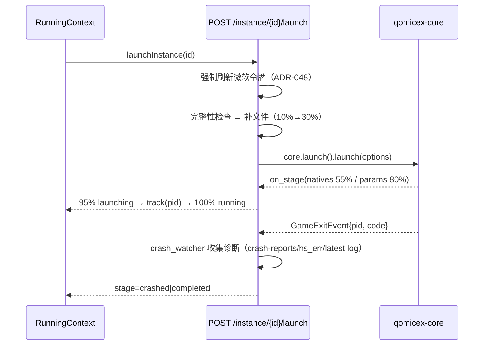
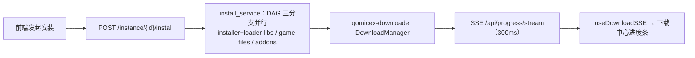
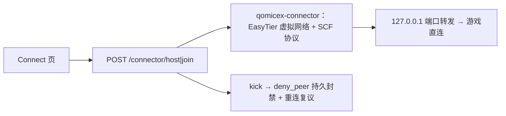
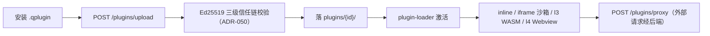

# 项目架构

> 最后更新：2026-10-09（对照 `a9a635ba` 校正）。
> 本文是**总览**；模块级细节见 [`模块划分.md`](模块划分.md)，按功能域的流程见同目录其他文档。

## 项目概述

Qomicex Launcher 是基于 Tauri v2 的 Minecraft 启动器，前后端分离 + 桌面外壳三层架构，
核心能力由 5 个 git submodule 提供。支持 Windows / Linux / macOS。

## 技术栈

| 层 | 技术 | 目录 |
|:---|:---|:---|
| 桌面外壳 | Tauri v2 (Rust) | `src-tauri/` |
| 前端 | React 19 + Vite 7 + TypeScript + Tailwind | `src/` |
| 后端 API | Rust（axum 0.8 + tokio） | `src-backend/qomicex-backend/` |
| UI 组件库 | workspace 包 `@qomicex/plugin-ui` | `packages/plugin-ui/` |

## 目录结构与职责

### 1. 前端层 `src/`

#### 1.1 入口与路由

| 文件 | 职责 |
|:---|:---|
| `src/main.tsx` | React 入口；`installDragRegions()` 装触控板拖动区（ADR-086/087） |
| `src/App.tsx` | 路由配置、全局 Provider、健康轮询、更新编排、插件加载、主题/日志桥 |
| `src/index.css` | 全局 CSS 变量（明暗主题）、材质与动画规则 |

**App.tsx 承担的职责**

- 路由（13 条真实路由 + 1 条通配；**仅在 `backendState === 'ready'` 时才注册**）
- 全局 Provider 嵌套：`I18nProvider → RunningProvider → MessageBoxProvider → ErrorBoundary`
- 启动时序编排：健康轮询 → 设置加载 → 初始化向导 → Java 引导 → 更新检查 → 待安装消费 → 插件加载
- 主题管理（明暗 / 预设 / 材质 / 字体 / 动画倍率）
- 全局异常与未处理 Promise 捕获
- `console` 包装（按 `logLevel` 过滤并上报后端日志体系）

两个独立窗口模式由 query 参数判定，**绕开 Layout**：

- `?logWindow=1&instance=<id>` → `GameLogWindow`（「测试游戏」打开的 Tauri 子窗口）
- `?pluginWebview=1&pluginId=<id>` → `PluginWebviewPage`（l4 插件独立窗口）

#### 1.2 页面 `src/pages/`

| 文件 | 职责 |
|:---|:---|
| `Dashboard.tsx` | 主页小组件网格（ADR-065），子目录 `dashboard/` |
| `Instances.tsx` | 实例列表、创建/删除/编辑、分组 |
| `InstanceDetail.tsx` | 实例详情，11 个 Tab（overview/settings/gamesettings/saves/screenshots/mods/resourcepacks/shaderpacks/datapacks/schematics/servers） |
| `DownloadCenter.tsx` | 下载中心，按资源类型分组（ADR-089） |
| `Accounts.tsx` / `AccountDetail.tsx` | 账户管理与详情 |
| `ResourceCenter.tsx` / `ResourceDetail.tsx` | 资源中心与资源详情 |
| `Connect.tsx` | 联机（开房 / 加入 / 踢人复议 / 模组校验） |
| `Settings.tsx` | 设置，8 个分区（launcher/java/plugins/appearance/toolbox/logs/about/debug） |
| `RunningInstances.tsx` | 运行中实例监控 |
| `LogAnalysis.tsx` | 日志分析 |
| `PluginPage.tsx` / `PluginWebviewPage.tsx` | 插件页面 / l4 插件独立窗口 |
| `GameLogWindow.tsx` | 独立游戏日志窗口 |

#### 1.3 组件 `src/components/`

121 个业务组件。核心几类：

- **布局**：`Layout.tsx`（侧边栏 + 标题栏 + 背景层）、`Sidebar.tsx`、`TitleBar.tsx`
- **进程与任务**：`LaunchProgressDialog`、`CrashAnalysisDialog`、`TaskCompletionNotifier`、`DownloadSpeedGraph`
- **实例内容**：`ModCard`、`ResourcePackCard`、`ShaderCard`、`SaveCard`、`ScreenshotCard`、`DataPackCard`
- **整合包**：`ImportDialog`、`ExportModpackDialog`、`ModpackInstallDialog`、`ModpackQuickInstallDialog`、`ModpackUpdateDialog`
- **插件**：`PluginOverlayManager`、`PluginStore*`、`PluginSettingsTab`、`SlotHost`
- **设置**：`settings/SettingRow.tsx`、`settings/RelayNodesSection.tsx`
- **引导与对话框**：`SplashScreen`、`InitialSetupWizard`、`ErrorBoundary`、`DeepLinkHandler`、`GlobalDropInstaller`

> UI 基元不在这里：实现在 `packages/plugin-ui/src/components/`，`src/components/ui/index.ts` 只做 re-export。

#### 1.4 API 层 `src/api/`（27 模块）

| 文件 | 职责 |
|:---|:---|
| `client.ts` | 统一请求封装（**不是 axios**，是 fetch + 超时/取消桥接）；`ApiError` 类与错误码 i18n 钩子 |
| `ipc.ts` | 传输层：HTTP ↔ QIPC 端到端探测、流式通道、multipart 上传 |
| `instance.ts` | 实例 CRUD、启动、安装、整合包导入/导出 |
| `instance-files.ts` | 实例文件（mods/saves/资源包/光影/截图/存档/服务器） |
| `account.ts` | 账户登录（微软 / 离线 / Yggdrasil / LittleSkin / 统一通行证） |
| `resource.ts` / `resource-download.ts` | 资源中心搜索与下载 |
| `settings.ts` | 设置读写与变更订阅（**设置的事实源**） |
| `connector.ts` | 联机 |
| `update.ts` | 自更新计划与交接文件 |
| `plugins.ts` / `pluginStore.ts` | 插件本地管理 / 插件商店 |
| `java.ts` / `versions.ts` / `skin.ts` / `logs.ts` / `logAnalysis.ts` / `mcmod.ts` | 其余功能域 |
| `world-view.ts` / `announcements.ts` / `sponsors.ts` / `system.ts` / `telemetry.ts` / `license.ts` / `drop-install.ts` / `crashDiagnostics.ts` | 辅助能力 |

#### 1.5 状态管理 `src/stores/`

| 文件 | 机制 | 职责 |
|:---|:---|:---|
| `updaterStore.ts` | zustand | 自更新状态机（下载 / 暂存 / 安装 / 错误） |
| `pluginStore.ts` | zustand | 插件列表、激活状态、overlay、更新检查 |
| `favoritesStore.ts` | zustand | 资源收藏与收藏夹 |
| `downloadStore.ts` | 模块级单例 + 自研 listener | 下载中心任务（`localStorage` 持久化，500ms debounce） |
| `javaStore.ts` | 模块级单例 + 自研 listener | Java 运行时缓存与扫描 |

> 注意：状态管理**三套范式混用**（zustand / React Context / 模块级单例）。
> `src/api/settings.ts` 是设置的唯一事实源，不要另建 store 缓存设置。

#### 1.6 自定义 Hook `src/hooks/`（14 个）

`useCloseGuard`（关闭保护）、`useDownloadSSE`（进度流 + 断线重连）、`useGsapAnimations`（页面/列表/弹窗动画）、
`usePageAnimation`、`useListSelection`（列表多选与拖框选择）、`useRequireDefaultAccount`、
`useScrollFade`、`closeGuardContext`。

#### 1.7 插件系统 `src/plugins/`

| 文件 | 职责 |
|:---|:---|
| `plugin-loader.tsx` | 激活 / 停用、依赖拓扑排序、l4 Webview 创建 |
| `plugin-registry.ts` | 跨插件方法调用注册表 |
| `hook-registry.ts` | Koa 洋葱管道 + 跨 iframe 两阶段桥 |
| `hookable.ts` | `hookable()` 包装器（把启动器方法变成可 hook） |
| `sandbox.ts` | iframe 沙箱 + `__PLUGIN_API__` 注入 |
| `plugin-api.ts` | 插件 API 桥接实现 |
| `plugin-css.ts` | 插件 CSS / 主题同步注入 |
| `slots.tsx` / `PluginSlot.tsx` | UI 槽位贡献 |
| `webview-bridge.ts` | l4 跨窗口事件桥 |
| `plugin-registry.ts` / `types.ts` | 类型与权限目录 |
| `pluginSettingsNav.ts` / `installer.ts` | 设置页导航注入 / 安装 |

插件分层：`l0`（主题包）/ `l1`（声明式贡献点）/ `l2`（前端 JS，inline 或 iframe）/ `l3`（WASM 沙箱）/ `l4`（独立 WebviewWindow）。

#### 1.8 主题 `src/theme/`

语义 token 规范、`.qtheme` 颜色主题（Catppuccin 四预设）、图标主题、主题管理器与订阅。
详见 [`主题语义Token规范v1.md`](主题语义Token规范v1.md)。

### 2. 后端层 `src-backend/qomicex-backend/`

#### 2.1 入口与基础设施

| 文件 | 职责 |
|:---|:---|
| `src/main.rs` | 入口：加载 dev env → 构建 AppState → panic hook → tracing → 回滚半更新整合包 → 建立 TCP + QIPC 双监听 |
| `src/app.rs` | 路由组装（`Router::nest("/api", ...)`）、CORS、请求日志、404 fallback |
| `src/state.rs` | `AppState`（`Arc` 单例集合）、HTTP 客户端构造、下载管理器热替换 |
| `src/settings.rs` | 设置持久化 + 数据目录解析 |
| `src/error.rs` | `ApiError` / `ApiResult` 统一错误契约 |
| `src/ipc.rs` | QIPC 帧协议服务端 |
| `src/middleware/not_found.rs` | 404 fallback |
| `src/models.rs` / `src/util/` | 共享模型 / 工具 |

#### 2.2 端点层与 Service 层

模块清单、路由数与职责分组见 [`模块划分.md`](模块划分.md)（避免两处维护同一张表）。

#### 2.3 数据持久化

无数据库。全部状态为 JSON：`{BaseDir}/QML/*.json`（settings / instances / accounts / groups /
java-runtimes / plugin-states / plugin-fs-auth / resource_favorites / version-scan-cache 等），
更新交接文件在 `{BaseDir}/updates/`，整合包清单在实例内 `.qomicex/modpack-manifest.json`。

### 3. Tauri 外壳 `src-tauri/`

| 文件 | 职责 |
|:---|:---|
| `src/main.rs` | 二进制入口 |
| `src/lib.rs` | 窗口创建、单实例插件注册、后端解压与 spawn、拖放事件、invoke handler 注册 |
| `src/ipc.rs` | QIPC 客户端 + `qomicex://` 自定义协议处理器 + 流式 Channel |
| `src/updater.rs` | 自更新编排（内嵌 updater 解压、detached spawn、交接文件读写） |
| `src/deep_link.rs` | `qomicex-launcher://` 深链解析与 OS 注册自愈 |
| `src/dnd.rs` | Windows 自实现 `IDropTarget`（同时接文件与文本拖拽，ADR-093） |
| `src/dialog_cmd.rs` | 原生对话框命令 |
| `src/logger.rs` | `log` crate → 统一日志后端 |
| `src/plugin_gateway/` | WASM 插件网关（`loader` / `server` / `config` / `permission`） |
| `tauri.conf.json` | 窗口、CSP、bundle、deep-link、updater 配置 |

> 注意：`src-tauri/src/version_order.rs` **不存在**（旧文档曾引用它）。版本排序现由
> `src-backend/qomicex-backend/src/endpoints/version.rs` 承担。

### 4. UI 组件库 `packages/plugin-ui/`

- `src/components/` — 20 个基元组件（Badge / BatchToolbar / Button / Card / Checkbox / Combobox / Dialog / Input / Label / MessageBox / Popover / Select / Separator / Skeleton / Switch / Table / Tabs / Textarea / Tooltip）
- `src/lib/dragRegions.ts` — 触控板拖动区与滚动手势（ADR-086/087）
- `src/plugins.ts` — 插件类型与权限目录
- `src/tailwind-preset.ts` — 供外部消费的 Tailwind 预设

发布入口为 `dist/index.js`（gitignored）→ **改 `src/` 后必须重建**，否则启动器用旧产物。

### 5. 外部依赖（Git Submodules）

| 子模块 | 职责 |
|:---|:---|
| `qomicex-core-rust` | 启动引擎、版本管理、Mod 交互、认证、Java 发现 |
| `qomicex-downloader-rust` | 并发下载管理器 |
| `qomicex-connector-rust` | 联机（EasyTier / NAT 穿透 / SCF 协议） |
| `qomicex-tauri-i18n` | 7 语言资源 |
| `Qomicex.Updater` | 独立外部更新器（release 打包使用） |

## 数据流架构

### 1. 启动游戏

### 2. 安装 / 下载

### 3. 联机

### 4. 插件

## 架构特点

1. **前后端分离**：React 前端 + 独立 Rust 后端进程，dev 走 HTTP、release 走命名管道（ADR-040）
2. **插件生态**：inline / iframe / WASM / 独立 Webview 四种运行形态，带签名信任链
3. **跨平台**：Windows / Linux / macOS（含 ARM64、LoongArch64、RISC-V 64 实验性）
4. **实时通信**：SSE 推送进度，IPC 模式经 `invoke + Channel` 消费
5. **无数据库**：全部 JSON 持久化
6. **核心外置**：启动引擎 / 下载器 / 连接器 / i18n 均为 submodule，可独立演进

## 修订记录

| 日期 | 版本 | 修改内容 |
|:---|:---|:---|
| 2026-09-01 | v1.0 | 初版创建 |
| 2026-10-09 | v2.0 | 对照 `a9a635ba` 校正：删除不存在的 `version_order.rs`；端点数 23 → 31、路由数改为实测 280；hooks 6 → 14；移除重复段落；技术栈与路由计数改为实测值 |
