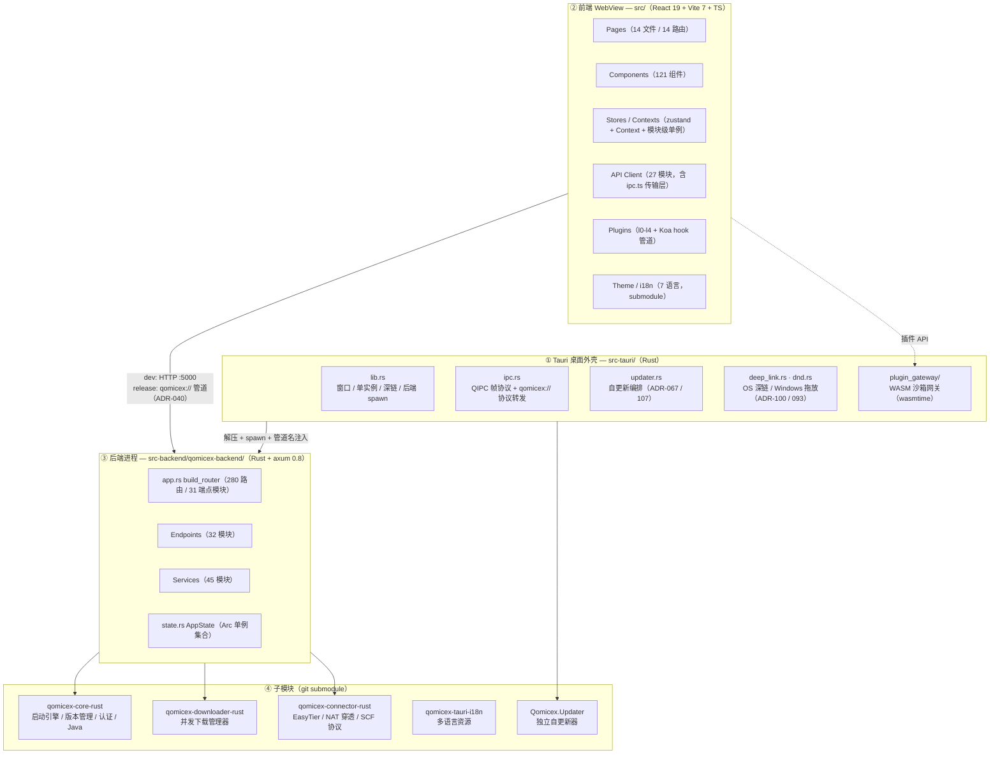

# 模块划分

> 最后更新：2026-10-09（对照 `a9a635ba` 校正）。本文只描述**当前**栈。
> 历史快照见文末「历史修订」。

## 系统架构图

## 前端模块

| 模块 | 目录 | 职责 |
|:---|:---|:---|
| API 客户端 | `src/api/` | 27 个模块封装后端调用，含 `ApiError` 类；`ipc.ts` 是 HTTP/IPC 双传输层 |
| 页面 | `src/pages/` | 18 个文件（`App.tsx` 注册 13 条真实路由 + 1 条通配；`GameLogWindow`/`PluginWebviewPage` 由 query 参数分支，非路由） |
| UI 基元 | `packages/plugin-ui/src/components/` | 20 个 Radix 基元组件（Button / Dialog / Select / Tooltip 等） |
| UI re-export | `src/components/ui/` | 仅做 barrel re-export，**不承载实现** |
| 领域组件 | `src/components/` | 121 个业务组件（ModCard / Sidebar / LaunchProgressDialog 等） |
| 状态管理 | `src/stores/` | zustand（updater / plugin / favorites）+ 模块级单例（download / java） |
| 上下文 | `src/contexts/` | `RunningContext`（运行实例、启动进度、崩溃） |
| Hooks | `src/hooks/` | 14 个（useCloseGuard / useDownloadSSE / useGsapAnimations / useListSelection / useScrollFade …） |
| 插件 | `src/plugins/` | 分层加载（l0-l4）、hook 管道、iframe/WASM 沙箱、槽位注入 |
| 主题 | `src/theme/` | 语义 token、`.qtheme` 颜色主题、图标主题 |
| 工具库 | `src/lib/` | cn、simple-cache、skin-avatar、fps-limiter、schematic-viewer、deepLink 等 24 个模块 |
| 类型定义 | `src/types/` | 共享 TypeScript 类型（约 1080 行） |
| 常量 | `src/constants/` | credits.ts |

## 后端模块（qomicex-backend）

后端根目录 `src-backend/qomicex-backend/`，入口 `src/main.rs`（Tokio + axum 0.8）。
默认 `127.0.0.1:5000`，`QOMICEX_PORT` 可覆盖；release 下由 Tauri 注入 `QOMICEX_IPC_PIPE` + `QOMICEX_NO_TCP=1` 走**纯管道**（无 TCP 端口）。

### 端点层（`src/endpoints/`，31 模块 / 280 路由）

| 端点模块 | 路由前缀 | 路由数 |
|:---|:---|---:|
| instance_files | `/api/instance/{id}/files` | 51 |
| system | `/api/system`、`/api/settings`、`/api/health`、`/api/diagnostics` | 30 |
| plugin | `/api/plugins` | 26 |
| instance | `/api/instance` | 20 |
| resource_center | `/api/resources` | 16 |
| modpack | `/api/modpack` | 15 |
| plugin_store | `/api/store` | 14 |
| connector | `/api/connector` | 13 |
| java | `/api/java` | 13 |
| auth | `/api/auth` | 10 |
| log | `/api/logs` | 9 |
| account | `/api/account` | 8 |
| skin | `/api/skin` | 8 |
| version | `/api/versions` | 8 |
| resource_download | `/api/resource-download` | 6 |
| world_view | `/api/instance/{id}/world` | 4 |
| modpack_update | `/api/instance/{id}/modpack` | 3 |
| littleskin | `/api/auth/littleskin` | 3 |
| instance_logs | `/api/instance/{id}/logs` | 3 |
| update | `/api/update` | 3 |
| loader | `/api/loaders` | 2 |
| license | `/api/license` | 2 |
| launch | `/api/launch` | 2 |
| resource | `/api/resources/complete` | 2 |
| loganalysis | `/api/loganalysis` | 2 |
| mcmod | `/api/mcmod` | 2 |
| progress_sse | `/api/progress/stream` | 1 |
| client_logs | `/api/client/logs` | 1 |
| sponsors | `/api/sponsors` | 1 |
| announcement | `/api/client/announcements` | 1 |
| telemetry | `/api/telemetry` | 1 |
| 探针 | `/ping` | 1 |

路由在 `app.rs` 的 `build_router` 里以 `Router::nest("/api", ...)` 组装，**端点模块内写的路径不含 `/api` 前缀**。

### Service 层（`src/services/`，45 模块，按职责分组）

| 分组 | 模块 |
|:---|:---|
| 实例与安装 | `instance`、`instance_group`、`install_service`、`install_tracker`、`options` |
| 启动与运行 | `launch_tracker`、`crash_watcher`、`game_log`、`kick` |
| 整合包 | `modpack_manifest`、`modpack_export`、`modpack_update`、`technic`、`multimc`、`archive` |
| 资源与下载 | `curseforge_fetch`、`file_mirror`、`resource_favorite`、`resource_favorite_folder`、`schematic_assets` |
| 账号与许可 | `account`、`license`、`license_core` |
| 插件 | `plugin`、`plugin_store`、`plugin_signature` |
| 日志与诊断 | `trace`、`log_analysis`、`error_report`、`export_tracker` |
| 世界预览 | `world_view/`（region / render / palette / biome / nbt / legacy_ids / world） |
| 基础设施 | `scan_cache`、`update_channel`、`translation` |

### 基础设施

- `app.rs` — 路由组装；`CorsLayer::permissive()`；`TraceLayer` 只记录 ≥400 的请求
- `state.rs` — `AppState`（`Arc` 共享）+ `DEFAULT_PORT = 5000`；`download_manager` 是 `ArcSwap`，支持热替换
- `settings.rs` — 设置加载 + 数据目录解析（`QOMICEX_HOME` → `.qomicex-bootstrap` → `{LocalAppData}/qomicex-launcher`）
- `error.rs` — 统一错误类型 `ApiError` / `ApiResult<T>`
- `ipc.rs` — QIPC 帧协议服务端
- `middleware/not_found.rs` — 404 fallback（先于 CORS layer 注册）
- `util/` — `pcl_icon`、`sysinfo`
- `dev_env.rs` — debug-only `.env.local` 加载

## 数据流要点

- **持久化**：无数据库，全部为 JSON（`{BaseDir}/QML/*.json` + 实例内 `.qomicex/modpack-manifest.json`）
- **进度推送**：统一走 SSE `/api/progress/stream`（300ms 轮询 + broadcast 触发）
- **版本隔离**：`GameDir` 为根，隔离目录在 `GameDir/versions/{inst.Name}/`，共享目录（versions/assets/libraries/logs/temp）在 `GameDir` 根
- **传输**：dev/CI 走 HTTP `:5000`；release 走 QIPC 命名管道 + `qomicex://` 自定义协议转发

## 历史修订

| 日期 | 修订 |
|:---|:---|
| 2026-07-30 | 初版（C# ASP.NET Core 10 NativeAOT 后端时代） |
| 2026-08-09 | 记录 Rust 重写进度（当时实例/资源中心部分为 501 stub） |
| 2026-08-13 | instance_files 的 servers / server-ping / lan-games 由 501 stub 转为真实实现 |
| 2026-10-09 | **对照 `a9a635ba` 全量校正**：移除 C# 时代内容（NativeAOT / Qomicex.Core.AOT / Qomicex.Downloader / Connector.Scaffolding 等已迁至 submodule 或 `legacy` 分支），路由与模块计数改为实测值，补 Mermaid 架构图 |

> 旧版本文中「Backend (ASP.NET Core 10 NativeAOT)」「Qomicex.Core.AOT」「Qomicex.Downloader」
> 「Qomicex.Connector.Scaffolding」等描述对应 **legacy 分支**，当前 main 已无这些工程。
