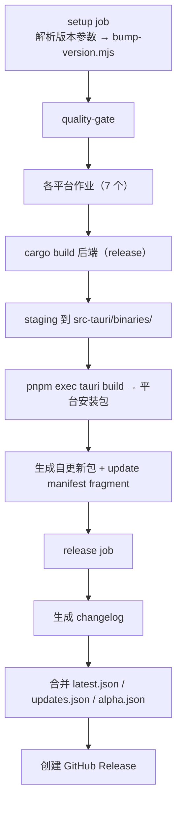

# 构建与部署

> 最后更新：2026-10-09（对照 `a9a635ba` 校正）。本文已移除 C#/.NET 时代内容 —— 后端现为 Rust。

## 开发环境

### 前置要求

| 组件 | 版本要求 | 用途 |
|:---|:---|:---|
| Node.js | >= 22 | 前端构建（`package.json` 的 `engines`） |
| pnpm | >= 11 | JS 依赖（仓库唯一事实来源） |
| Rust | **1.95.0**（由 `rust-toolchain.toml` 钉住） | 后端 + Tauri 外壳 |
| PowerShell | 5.1+ (Windows) / pwsh (其他) | 测试脚本 |

**不需要 .NET SDK** —— 后端已重写为 Rust，旧 C# 实现只存在于 `legacy` 分支。

### 初始化（全新检出）

```bash
git submodule update --recursive
pnpm install --frozen-lockfile
pnpm --filter @qomicex/plugin-ui build   # dist/ 是 gitignored，前端依赖它
```

### 前端开发

```bash
pnpm run dev          # Vite dev server，端口 1420
pnpm run typecheck    # tsc --noEmit
pnpm run build        # plugin-ui 构建 → tsc → vite build（类型错误会失败）
```

### 后端开发

```bash
cargo run --manifest-path src-backend/qomicex-backend/Cargo.toml
# 或
pnpm run dev:backend
```

默认监听 `127.0.0.1:5000`，`QOMICEX_PORT` 可覆盖。
Vite dev server 将 `/api/*` 代理到 `localhost:5000`。

> Windows 运行后端需要 npcap 的 `Packet.dll`（联机功能依赖），缺失会以 `0xC0000135` 退出。

### Tauri 桌面开发

```bash
pnpm run tauri dev    # 启动 Tauri 窗口 + 前端；后端需另行启动
```

> **注意**：`tauri.conf.json` 里 `beforeDevCommand` / `beforeBuildCommand` 目前写的是 `npm run ...`，
> 而本仓库是 pnpm-managed。命令本身能跑（npm 会读 `package.json`），但与 AGENTS.md「只用 pnpm」的约定不一致。

### 测试

```bash
cargo test --manifest-path src-backend/qomicex-backend/Cargo.toml   # 后端单测
cargo test --manifest-path src-tauri/Cargo.toml --lib plugin_gateway # Tauri WASM 网关测试
pnpm run typecheck                                                    # 前端类型检查
bash scripts/test-api-filters.sh                                      # 行为测试（需后端在跑）
pnpm run test:update-channel                                          # 更新通道解析
pnpm run test:deep-link                                               # 深链解析
pnpm run test:i18n-steps                                              # i18n 步骤文案覆盖
```

**前端没有单元测试框架** —— `playwright` 仅用于 `scripts/harness/`。

### 格式化与静态检查

```bash
cargo fmt --manifest-path src-backend/qomicex-backend/Cargo.toml
cargo fmt --manifest-path src-tauri/Cargo.toml
cargo clippy --manifest-path src-backend/qomicex-backend/Cargo.toml --no-deps -- -D warnings
pnpm run lint
pnpm run format:check
```

> ⚠️ **不要顺手 `pnpm run format`**：仓库全量未格式化（`prettier --check .` 有 522 个文件不符），
> 全量重排必须是一次独立的 `style:` 提交。

## 构建系统

### GitHub Actions CI/CD

| Workflow | 用途 |
|:---|:---|
| `.github/workflows/ci.yml` | PR / push 到 main → `frontend-check` + `backend-check`（cargo test + clippy + fmt） |
| `.github/workflows/release.yml` | 发布构建（7 个平台作业 + 自更新包 + 清单合并） |
| `.github/workflows/debug.yml` | 调试构建 |
| `.github/workflows/codeql.yml` | 安全扫描 |

### 触发方式

1. **workflow_dispatch** — 手动触发，填写版本参数
2. **release:published** — GitHub Release 发布时从 tag 解析版本

### 版本格式

```
v<major>.<minor>.<patch>-<type><序数>.<补丁>
```

例：`v0.1.0-release1.0`、`v0.1.0-beta31.0`、`v0.1.0-alpha20260823.0`

| 类型 | 序数来源 |
|:---|:---|
| release | 手动输入（`releaseNum`） |
| beta | 手动输入（`releaseNum`） |
| alpha | 自动取当天日期 + 当日构建序号 |

发布构建会先执行 `scripts/bump-version.mjs <VERSION>` 同步 `Cargo.toml` 的 version，
因此后端 `env!("CARGO_PKG_VERSION")` 自动跟随发布版本。

### 构建参数（`release.yml` 的 `workflow_dispatch.inputs`）

| 参数 | 说明 | 默认 / 可选值 |
|:---|:---|:---|
| `major` / `minor` / `patch` | 版本号三段 | `0` / `1` / `0` |
| `releaseType` | 发布类型 | choice |
| `releaseNum` | 发布序数（仅 release/beta） | `1` |
| `licenseRequired` | 启用许可证验证（cargo feature `license-required`） | `false` |
| `prerelease` | 标记为 GitHub Pre-release | `false` |
| `required` | 强制更新（用户必须更新才能继续使用） | `false` |
| `buildPlatform` | 构建平台 | `all` |
| `linuxBundles` | Linux 打包格式 | `appimage,deb,rpm` |
| `macosArch` / `windowsArch` / `linuxArch` | 各平台架构 | `both` |

### 构建流程



平台矩阵：`windows-x86_64`、`windows-aarch64`、`linux-x86_64`、`linux-aarch64`、
`linux-loongarch64`、`darwin-aarch64`、`darwin-x86_64`。

### 本地打包

```bash
pnpm --filter @qomicex/plugin-ui build
pnpm exec tauri build        # ⚠ 必须用 pnpm exec，不要用 pnpm run tauri -- build
```

> 仓库内**没有** `build-release.ps1`（旧文档曾引用）；本地复现发布包请按上面的步骤手工执行。

## 项目结构

```
Qomicex.Tauri/                        # 主仓库
├── src/                              # React 前端
├── packages/
│   ├── plugin-ui/                    # @qomicex/plugin-ui（UI 组件库）
│   └── qomicex-cli/                  # @qomicex/cli（插件脚手架）
├── src-tauri/                        # Tauri Rust 桌面壳
├── src-backend/
│   └── qomicex-backend/              # 主 API（Rust + axum 0.8）
├── scripts/                          # 构建 / 测试脚本
├── docs/junsi-dev-docs/              # 文档与 ADR
├── .github/workflows/                # CI/CD
├── qomicex-core-rust/                # 子模块：核心引擎
├── qomicex-downloader-rust/          # 子模块：下载器
├── qomicex-connector-rust/           # 子模块：联机
├── qomicex-tauri-i18n/               # 子模块：多语言资源
└── Qomicex.Updater/                  # 子模块：独立更新器
```

> ⚠️ `src-backend/` 下还有 4 个 **gitignored 的本地残留目录**
> （`Qomicex.Launcher.Backend.Neo` / `Qomicex.Core.AOT` / `Qomicex.Downloader.Refactor` /
> `Qomicex.Connector.Part.Scaffolding`）。它们是旧 C# 时代的本地产物，**不是代码**，
> 其中含 NTFS 保留名，递归扫描会 ENOENT。

### Git 子模块

```bash
git submodule update --init --recursive
```

修改子模块内容需在**子模块仓库内单独提交推送**，再回到主仓库 `git submodule update --remote`。

## 跨平台构建

| 架构 | Windows | macOS | Linux |
|:---|:---|:---|:---|
| x64 | NSIS 安装包 | DMG | AppImage / Deb / Rpm |
| ARM64 | NSIS 安装包 | DMG | AppImage / Deb / Rpm |
| LoongArch64 | - | - | 支持 |
| RISC-V 64 | - | - | 实验性 |

## 已知构建陷阱

| 陷阱 | 说明 |
|:---|:---|
| 连接器构建 | `.cargo/config.toml` 提供 `PROTOC` / `VC_LTL` / `YY_THUNKS`（本机路径，换机器需调）；easytier 按相对路径找 `Packet.lib` |
| `Packet.dll` | Windows 运行后端必需（npcap），缺失 → `0xC0000135` |
| `wintun.dll` | TUN 模式需要（缺失仅 TUN 不可用，不崩） |
| 架构不匹配 DLL | → `0xC000007B` |
| CI 调 tauri CLI | 必须 `pnpm exec tauri build`，**不要** `pnpm run tauri -- build` |
| 交叉编译 | 额外 `rustup target add <triple>`（工具链钉 1.95.0，`dtolnay/rust-toolchain@stable` 只装到 stable） |
| Mac Create DMG | 必须给 `hdiutil create` 显式 `-size`（×1.3 + 64MiB），否则 `No space left on device` |
| 子模块 checkout | CI 需要 `QOMICEX_PAT` 密钥 |
| 后端配置注入 | `appsettings.json` 不入库，由 `build.rs` 以 `appsettings.example.json` 为模板 + `CURSEFORGE_API_KEY` / `MICROSOFT_CLIENT_ID` 生成 |

## 修订记录

| 日期 | 修改内容 |
|:---|:---|
| 2026-07-30 | 初版（C# ASP.NET Core 10 NativeAOT 时代） |
| 2026-08-09 | 更新为 Rust 后端，但项目结构段仍留有 C# 残留描述 |
| 2026-10-09 | 全量校正：移除 .NET SDK 前置要求与 `dotnet run`；补真实 `workflow_dispatch` 参数（`releaseNum`/`required`/`linuxArch`）；补测试与格式化命令；移除不存在的 `build-release.ps1`；补构建陷阱表 |
